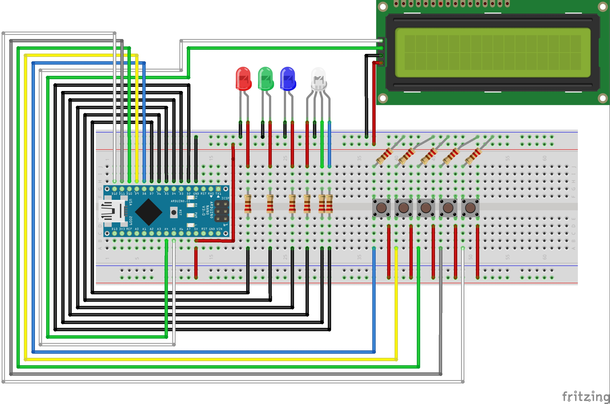

# RGB LED Interaction

The RGB LED Interaction is a mini game that was developed for my Master Thesis "Developing a Support Infrastructure for an Escape The Room and Peddy Paper Games".

This mini game, or interaction as I so call it, was developed to be part of an Escape the Room game that was also developed as part of my thesis. Since this interaction can work as a standalone mini game I decided to place it here for anyone interested in using it.

## List of Components

- Display LCD 16x2 1602 I2C IIC (1x);
- Red LED (1x);
- Green LED (1x);
- Blue LED (1x);
- RGB Diffused Common Cathode (1x);
- Button (5x);
- 220Ω Resistor (11x);
- Arduino Nano (1x);

In order to fully assemble the Interaction, so as to look like the picture below, you will also need to 3D Print the enclosure which is divided into two parts that can be found [here](enclosure/).

## The Purpose of The Game

This interaction has the purpose of being a visual representation of how RGB color works by employing the use of a Red, Green and Blue LED to show what color results from the different intensity of these LEDs in the RGB LED. So for example, if only the RED LED is lit then that means that the RGB LED will show RED because its Green and Blue components are 0.

The way this game works is that the person must introduce, via the buttons, the values of the Red, Green and Blue LEDs and, by introducing these values, the RGB LED will show the resulting color. Unfortunately, since this interaction was meant to be played in the context of an Escape The Room, there is no way, besides trial and error (Painstaking trial and error since we are talking about 255x255x255 combinations), to guess which are the correct numbers. 

None the less you will know the numbers of the green, blue and red LEDs beforehand because they will be printed in the Arduino IDE serial monitor. From there you can use those numbers to showcase how RGB makes colors in computer systems vary and create other playful experiences with this interaction.

## Instructions

First start by uploading the code to your Arduino Nano (This is the one I used so I can only guarantee proper working with this micro-controller).

### Starting the Game

To start the game you must first type in the Arduino IDE serial monitor the following:

- > COM:START;ID:123456789

This command will then print in the Serial Monitor the solution of the game which then needs to be introduced using the buttons. If the introduced combination of Red, Green and Blue is correct then the following message will appear in the serial monitor:

- > COM:INTERACTION_SOLVED;MSG:Correct RGB Combination;PNT:2345

# Warning

The source code for this interaction contains a lot of logic that was made to communicate with the infrastructure that was developed for my thesis and therefor it is not as clean as it could be when compared to a mini game that is developed with the intent of being used by the Arduino IDE directly.